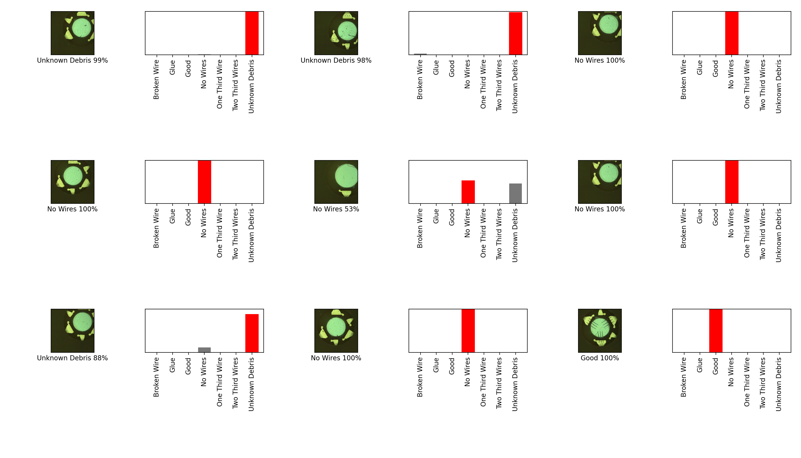

# APDL_Quality_Control
This project is intended to help with the quality control process of manufacturing calorimeters. 

### `datasets/` 
This directory is split up into a `testing/`, `training/` & `original/` sub directory
each has a child directory that corresponds to it's name. 
- `original/` is for manually classified images an should never be modified 
- `training/` is contains augmented & original images, each sub directory should have over a hundred images
- `testing/` contains images separated from training before augmentation and each sub directory should have at least two images

### `models`
This is where models are saved after training and retrieved for testing.
`train_model.py` models will save the Teserflow model in a directory with the
format `MM_DD_H:MM:SSAM/PM`. 

Ex:
```text
03_24_6:45:34PM
├── assets
├── saved_model.pb
└── variables
    ├── variables.data-00000-of-00001
    └── variables.index
```

### `scripts/separate_datasets.py`
Separates training images into a testing directory while preserving 
parent their respective parent directories, this is done so that the model is not
tested on images that it is trained on. This script is not meant to be called directly
As it's easy to forget that you've called it and it "destructively" modifies the
training directory; Rather it's called by `augment_images.py` before augmenting images. 

### `train_model.py`
This thing is a work in progress 


### `augment_imgs.py`
Uses opencv, skimage & numpy to augment images randomly given a root directory. 


Example of expected outcome on 9 randomly selected images from our dataset



