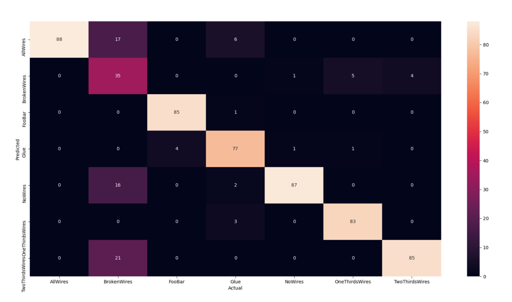
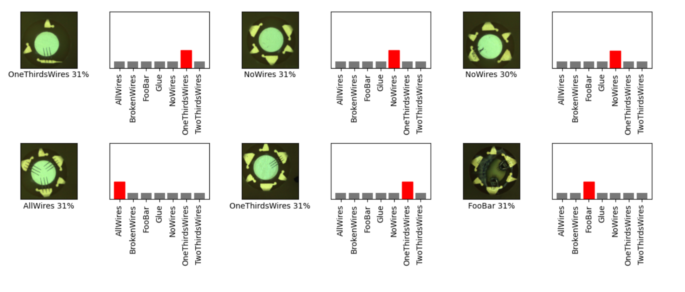

# APDL_Quality_Control
This project is intended to help with the quality control process of manufacturing calorimeters. 

### Confusion Matrix

### Radom Samples


### Installation 
It's important to specify this version of python as Tenserflow has not been working on the latest release 
```bash
git clone https://github.com/NotJoeMartinez/APDL_Quality_Control
cd APDL_Quality_Control 
virtualenv env --python=python3.9.2
source env/bin/activate 
pip install -r requirements.txt
```

If you still get an error installing tenserflow deactivate and remove
```bash
pip install --upgrade tensorflow
```

### augment_imgs.py
- Augments the original data
- Handles splitting the dataset up into training and testing. 
- Randomly applies a rotation function to data  

### train_model.py
- Trains model on the augmented dataset 
- Creates a plot of the training history 
- Writes some metadata to a csv

### test_model.py
- Tests trained models against the testing dataset
- Plots data into confusion matrix along with ac couple other visualizations
- Creates a markdown file with impeded plots and other metadata

### transfer_learning.py 
- Trains model using transfer learning model "mobilenet_v3_small_100_224"
- Not fully tested to current workflow (Mon Sep 27 07:37:26 CDT 2021)

# APDL_QC_API 
Flask based API for interacting with the Tenserflow models 

### Usage
```
curl -X POST -F 'image=@imgs/[PATH/TO/IMAGE].jpg' http://127.0.0.1:5000/get-labels
{
  "All Predictions": {
    "Broken Wire": "42%", 
    "Glue": " 1%", 
    "Good": "12%", 
    "No Wires": " 0%", 
    "One Third Wire": "37%", 
    "Two Third Wires": " 5%", 
    "Unknown Debris": " 3%"
  }, 
  "Image Size": [
    640, 
    480
  ], 
  "Predicted Label": "Broken Wire", 
  "Prediction Confidence": "42%"
}
```

### Installation 
```bash
pip install -r requirements.txt
export FLASK_APP=APDL_QC_API/__init__.py
export FLASK_ENV=development
flask run
```