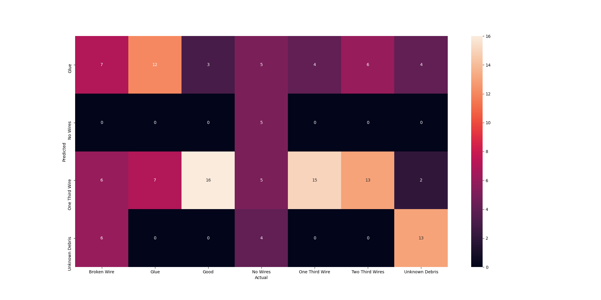
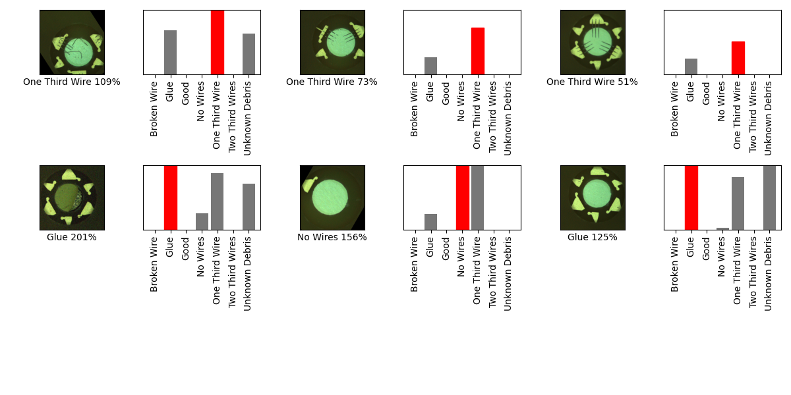

## 05_05_5:24:29PM 

Using pretrained mobilenet_v3_small_075_224. Still incorrect most of
the time but at least it's not guessing everything is glue. 

### Model Summary 
```Model: "sequential"
_________________________________________________________________
Layer (type)                 Output Shape              Param #   
=================================================================
keras_layer (KerasLayer)     (None, 1024)              1026552   
_________________________________________________________________
dropout (Dropout)            (None, 1024)              0         
_________________________________________________________________
dense (Dense)                (None, 7)                 7175      
=================================================================
Total params: 1,033,727
Trainable params: 1,024,047
Non-trainable params: 9,680
_________________________________________________________________
``` 
### Confusion Matrix 
 
### Random Samples 
 
### Dataframe predictions 
```          predicted           actual  confidence                                    path
0    One Third Wire   One Third Wire    2.368449  one_thirds_wires/augmented_image_3.jpg
1              Glue   One Third Wire    1.843386  one_thirds_wires/augmented_image_2.jpg
2    One Third Wire   One Third Wire    2.368449  one_thirds_wires/augmented_image_1.jpg
3    One Third Wire   One Third Wire    1.237886  one_thirds_wires/augmented_image_5.jpg
4    One Third Wire   One Third Wire    1.890849  one_thirds_wires/augmented_image_4.jpg
..              ...              ...         ...                                     ...
128            Glue  Two Third Wires    1.244636  two_thirds_wire/augmented_image_12.jpg
129  One Third Wire  Two Third Wires    0.378552  two_thirds_wire/augmented_image_16.jpg
130  One Third Wire  Two Third Wires    1.375232  two_thirds_wire/augmented_image_17.jpg
131  One Third Wire  Two Third Wires    1.143700  two_thirds_wire/augmented_image_15.jpg
132  One Third Wire  Two Third Wires    1.424367  two_thirds_wire/augmented_image_14.jpg

[133 rows x 4 columns]
```