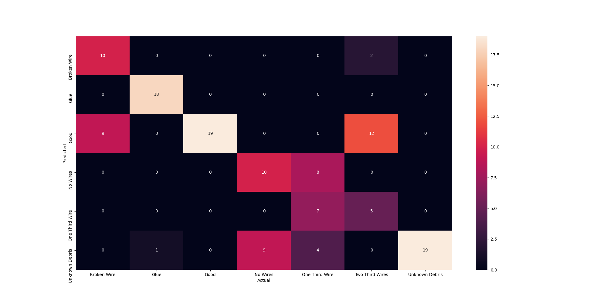
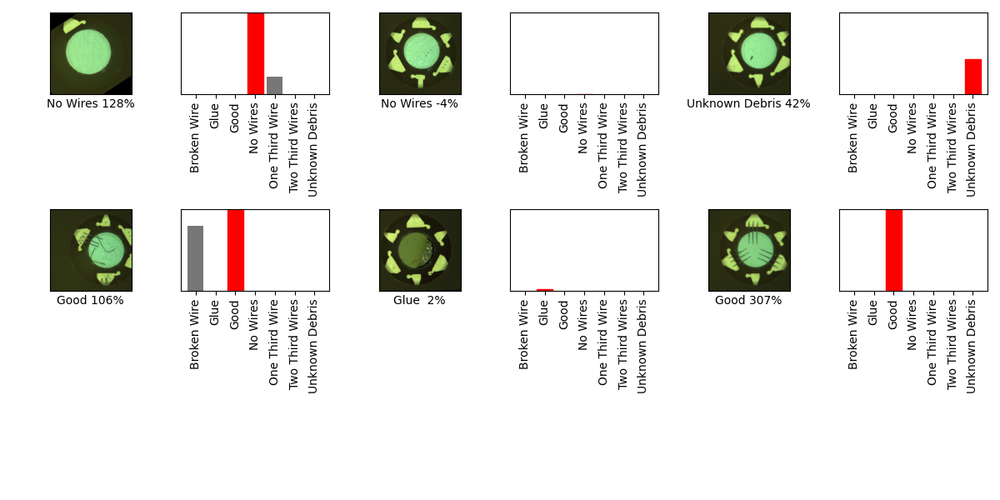

## 05_05_7:07:42PM 
Too accurate, probaly beacuase I trained it on the wrong dataset but
it was the training method was pull from this tutoral on transfer learning
https://github.com/tensorflow/docs/blob/master/site/en/tutorials/images/transfer_learning_with_hub.ipynb
### Model Summary 
```Model: "sequential_1"
_________________________________________________________________
Layer (type)                 Output Shape              Param #   
=================================================================
keras_layer_1 (KerasLayer)   (None, 1280)              2257984   
_________________________________________________________________
dense (Dense)                (None, 7)                 8967      
=================================================================
Total params: 2,266,951
Trainable params: 2,232,839
Non-trainable params: 34,112
_________________________________________________________________
``` 
### Confusion Matrix 
 
### Random Samples 
 
### Dataframe predictions 
```          predicted           actual  confidence                                    path
0    One Third Wire   One Third Wire   -0.511023  one_thirds_wires/augmented_image_3.jpg
1          No Wires   One Third Wire    0.301373  one_thirds_wires/augmented_image_2.jpg
2    One Third Wire   One Third Wire   -0.511023  one_thirds_wires/augmented_image_1.jpg
3          No Wires   One Third Wire    0.001090  one_thirds_wires/augmented_image_5.jpg
4          No Wires   One Third Wire    0.127283  one_thirds_wires/augmented_image_4.jpg
..              ...              ...         ...                                     ...
128     Broken Wire  Two Third Wires    0.360228  two_thirds_wire/augmented_image_12.jpg
129            Good  Two Third Wires    1.429995  two_thirds_wire/augmented_image_16.jpg
130  One Third Wire  Two Third Wires    1.192594  two_thirds_wire/augmented_image_17.jpg
131            Good  Two Third Wires    0.864801  two_thirds_wire/augmented_image_15.jpg
132            Good  Two Third Wires    0.201477  two_thirds_wire/augmented_image_14.jpg

[133 rows x 4 columns]
```