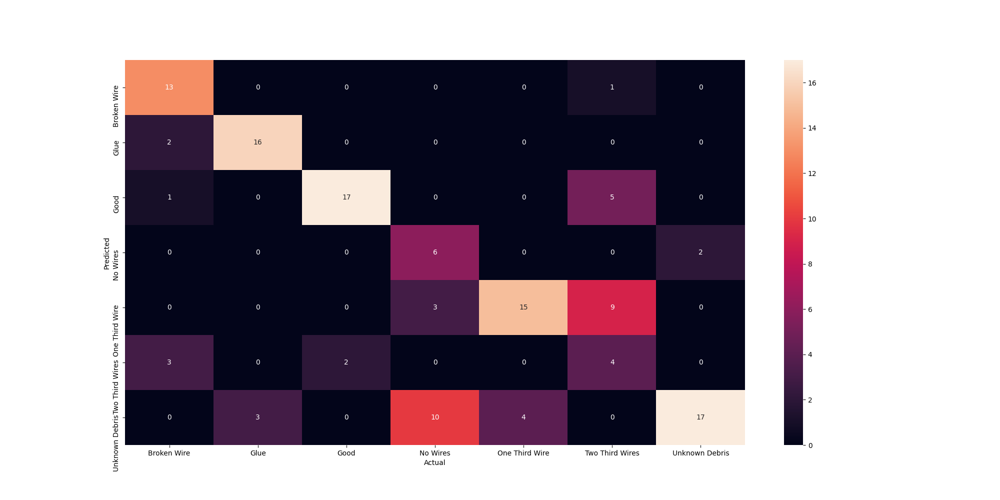
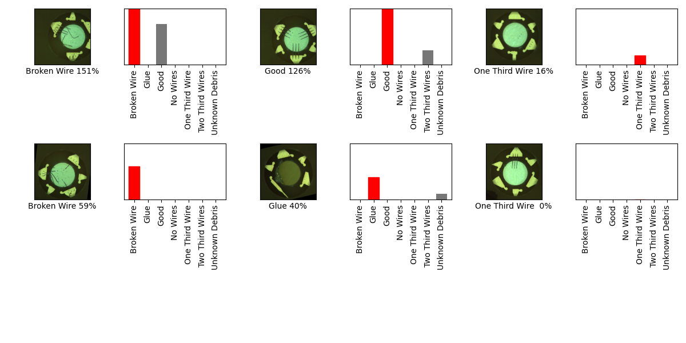

## 05_05_7:15:31PM 
Incredably accurate for some reason. Even though it's only using two epochs.

- Headless "feature_extractor_model"
- classifier_model ="https://tfhub.dev/google/tf2-preview/mobilenet_v2/classification/4"
- From this tutorial https://github.com/tensorflow/docs/blob/master/site/en/tutorials/images/transfer_learning_with_hub.ipynb

```python 
batch_size = 32
img_height = 224
img_width = 224
```


https://github.com/tensorflow/docs/blob/master/site/en/tutorials/images/transfer_learning_with_hub.ipynb
### Model Summary 
```Model: "sequential_1"
_________________________________________________________________
Layer (type)                 Output Shape              Param #   
=================================================================
keras_layer_1 (KerasLayer)   (None, 1280)              2257984   
_________________________________________________________________
dense (Dense)                (None, 7)                 8967      
=================================================================
Total params: 2,266,951
Trainable params: 2,232,839
Non-trainable params: 34,112
_________________________________________________________________
``` 
### Confusion Matrix 
 
### Random Samples 
 
### Dataframe predictions 
```           predicted           actual  confidence                                    path
0     One Third Wire   One Third Wire   -0.302736  one_thirds_wires/augmented_image_3.jpg
1     Unknown Debris   One Third Wire    0.465405  one_thirds_wires/augmented_image_2.jpg
2     One Third Wire   One Third Wire   -0.302736  one_thirds_wires/augmented_image_1.jpg
3     Unknown Debris   One Third Wire    0.399917  one_thirds_wires/augmented_image_5.jpg
4     One Third Wire   One Third Wire    0.150800  one_thirds_wires/augmented_image_4.jpg
..               ...              ...         ...                                     ...
128  Two Third Wires  Two Third Wires    1.885084  two_thirds_wire/augmented_image_12.jpg
129  Two Third Wires  Two Third Wires   -0.481660  two_thirds_wire/augmented_image_16.jpg
130   One Third Wire  Two Third Wires    1.598302  two_thirds_wire/augmented_image_17.jpg
131   One Third Wire  Two Third Wires    0.420499  two_thirds_wire/augmented_image_15.jpg
132   One Third Wire  Two Third Wires    0.841929  two_thirds_wire/augmented_image_14.jpg

[133 rows x 4 columns]
```