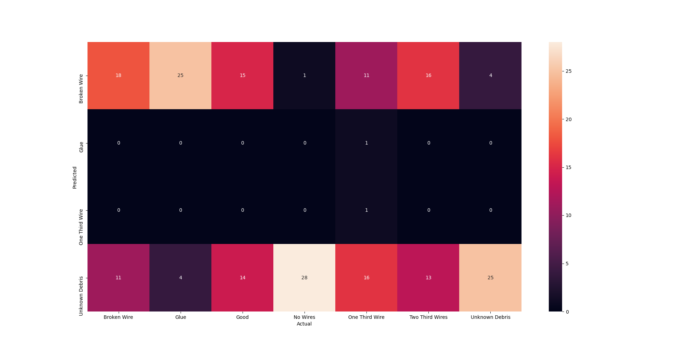
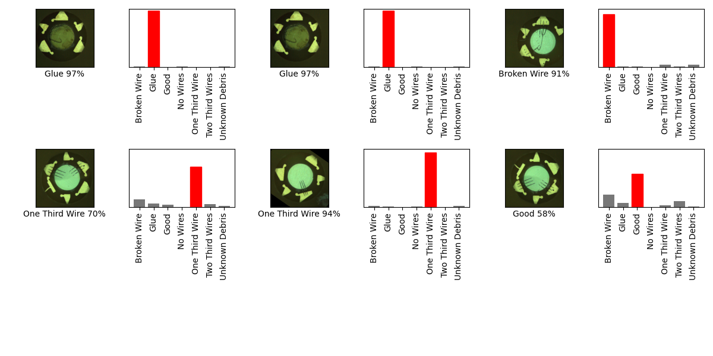

## 05_05_7:24:21PM 
Transfer learning with mobile net mobilenet_v2 

This was done with the code seen in `other_transfer_learning.py`
From this tutorail
https://github.com/tensorflow/docs/blob/master/site/en/tutorials/images/transfer_learning_with_hub.ipynb

```python
https://github.com/tensorflow/docs/blob/master/site/en/tutorials/images/transfer_learning_with_hub.ipynb
```

## Stats 
```
Total Tests: 133
correct predictions: 96
incorrect predictions: 37
Percentage correct: 72.18%
=======================
Most missed predictions
Broken Wire:  4
No Wires:  9
One Third Wire:  1
Two Third Wires:  18
Unknown Debris:  5
``` 
### Model Summary 
```Model: "sequential_1"
_________________________________________________________________
Layer (type)                 Output Shape              Param #   
=================================================================
keras_layer_1 (KerasLayer)   (None, 1280)              2257984   
_________________________________________________________________
dense (Dense)                (None, 7)                 8967      
=================================================================
Total params: 2,266,951
Trainable params: 2,232,839
Non-trainable params: 34,112
_________________________________________________________________
``` 
### Confusion Matrix 
 
### Random Samples 
 
### Dataframe predictions 
```     score        predicted           actual  confidence                                    path
0     True   One Third Wire   One Third Wire    2.466289  one_thirds_wires/augmented_image_3.jpg
1    False   Unknown Debris   One Third Wire    0.302970  one_thirds_wires/augmented_image_2.jpg
2     True   One Third Wire   One Third Wire    2.466289  one_thirds_wires/augmented_image_1.jpg
3     True   One Third Wire   One Third Wire    1.936762  one_thirds_wires/augmented_image_5.jpg
4     True   One Third Wire   One Third Wire    1.933097  one_thirds_wires/augmented_image_4.jpg
..     ...              ...              ...         ...                                     ...
128   True  Two Third Wires  Two Third Wires    1.152542  two_thirds_wire/augmented_image_12.jpg
129  False             Good  Two Third Wires   -0.009690  two_thirds_wire/augmented_image_16.jpg
130  False   One Third Wire  Two Third Wires    2.733370  two_thirds_wire/augmented_image_17.jpg
131  False   One Third Wire  Two Third Wires    0.137547  two_thirds_wire/augmented_image_15.jpg
132  False   One Third Wire  Two Third Wires    0.844969  two_thirds_wire/augmented_image_14.jpg

[133 rows x 5 columns]
```