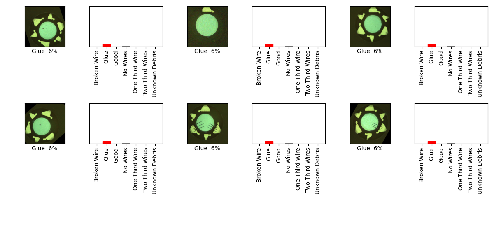

## 05_06_2:32:40PM 
Custom model, input shape 480 x 480 

```python3
model = Sequential([

    layers.experimental.preprocessing.Rescaling(1./255, input_shape=(img_height, img_width, 3)),
 
  layers.Conv2D(64, 3, padding='same', activation='relu'),
    layers.MaxPooling2D(),
    layers.Conv2D(32, 3, padding='same', activation='relu'),
    layers.MaxPooling2D(),
 
    layers.Conv2D(16, 3, padding='same', activation='relu'),
    layers.MaxPooling2D(),
 
    layers.Flatten(),
 
    layers.Dense(128, activation='relu'),
    layers.Dense(num_classes)
  ])
```


## Stats 
```
Total Tests: 133
correct predictions: 19
incorrect predictions: 114
Percentage correct: 14.29%
=======================
Most missed predictions
Broken Wire:  19
Good:  19
No Wires:  19
One Third Wire:  19
Two Third Wires:  19
Unknown Debris:  19
``` 
### Model Summary 
```Model: "sequential"
_________________________________________________________________
Layer (type)                 Output Shape              Param #   
=================================================================
rescaling (Rescaling)        (None, 480, 480, 3)       0         
_________________________________________________________________
conv2d (Conv2D)              (None, 480, 480, 64)      1792      
_________________________________________________________________
max_pooling2d (MaxPooling2D) (None, 240, 240, 64)      0         
_________________________________________________________________
conv2d_1 (Conv2D)            (None, 240, 240, 32)      18464     
_________________________________________________________________
max_pooling2d_1 (MaxPooling2 (None, 120, 120, 32)      0         
_________________________________________________________________
conv2d_2 (Conv2D)            (None, 120, 120, 16)      4624      
_________________________________________________________________
max_pooling2d_2 (MaxPooling2 (None, 60, 60, 16)        0         
_________________________________________________________________
flatten (Flatten)            (None, 57600)             0         
_________________________________________________________________
dense (Dense)                (None, 128)               7372928   
_________________________________________________________________
dense_1 (Dense)              (None, 7)                 903       
=================================================================
Total params: 7,398,711
Trainable params: 7,398,711
Non-trainable params: 0
_________________________________________________________________
``` 
### Confusion Matrix 
 
### Random Samples 
 
### Dataframe predictions 
```     score predicted           actual  confidence                                    path
0    False      Glue   One Third Wire    0.060296  one_thirds_wires/augmented_image_3.jpg
1    False      Glue   One Third Wire    0.060389  one_thirds_wires/augmented_image_2.jpg
2    False      Glue   One Third Wire    0.060296  one_thirds_wires/augmented_image_1.jpg
3    False      Glue   One Third Wire    0.060286  one_thirds_wires/augmented_image_5.jpg
4    False      Glue   One Third Wire    0.060251  one_thirds_wires/augmented_image_4.jpg
..     ...       ...              ...         ...                                     ...
128  False      Glue  Two Third Wires    0.060290  two_thirds_wire/augmented_image_12.jpg
129  False      Glue  Two Third Wires    0.060285  two_thirds_wire/augmented_image_16.jpg
130  False      Glue  Two Third Wires    0.060328  two_thirds_wire/augmented_image_17.jpg
131  False      Glue  Two Third Wires    0.060353  two_thirds_wire/augmented_image_15.jpg
132  False      Glue  Two Third Wires    0.060360  two_thirds_wire/augmented_image_14.jpg

[133 rows x 5 columns]
```