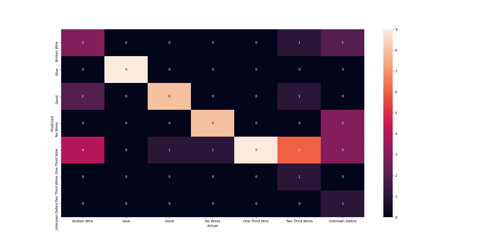
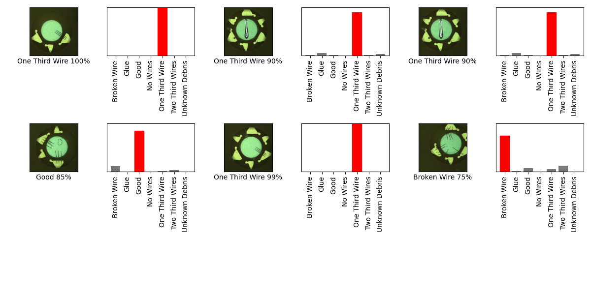

## 05_20_7:49:27PM 

## Stats 
```
Total Tests: 14
correct predictions: 8
incorrect predictions: 6
Percentage correct: 57.14%
=======================
Most missed predictions
Glue:  1
No Wires:  1
Two Third Wires:  2
Unknown Debris:  2
``` 
### Model Summary 
```Model: "sequential"
_________________________________________________________________
Layer (type)                 Output Shape              Param #   
=================================================================
sequential_1 (Sequential)    (None, 7)                 2266951   
_________________________________________________________________
softmax (Softmax)            (None, 7)                 0         
=================================================================
Total params: 2,266,951
Trainable params: 2,232,839
Non-trainable params: 34,112
_________________________________________________________________
``` 
### Confusion Matrix 
 
### Random Samples 
 
