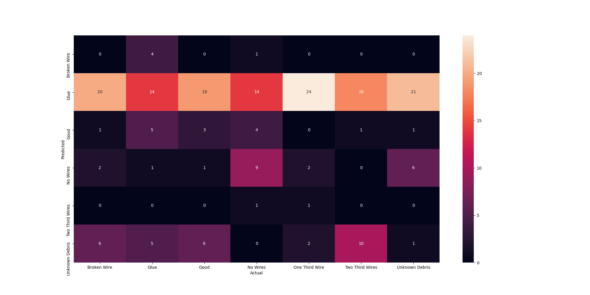
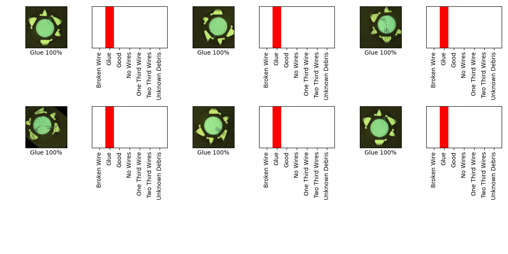

## 06_02_3:36:43PM 

## Stats 
```
Total Tests: 203
correct predictions: 27
incorrect predictions: 176
Percentage correct: 13.3%
=======================
Most missed predictions
Broken Wire:  29
Glue:  15
Good:  26
No Wires:  20
One Third Wire:  29
Two Third Wires:  29
Unknown Debris:  28
``` 
### Model Summary 
```Model: "sequential"
_________________________________________________________________
Layer (type)                 Output Shape              Param #   
=================================================================
keras_layer (KerasLayer)     (None, 1024)              1529968   
_________________________________________________________________
dropout (Dropout)            (None, 1024)              0         
_________________________________________________________________
dense (Dense)                (None, 7)                 7175      
=================================================================
Total params: 1,537,143
Trainable params: 1,525,031
Non-trainable params: 12,112
_________________________________________________________________
``` 
### Confusion Matrix 
 
### Random Samples 
 
