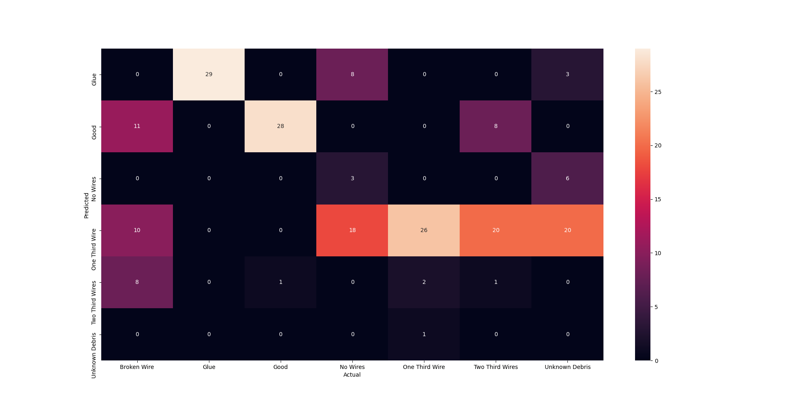
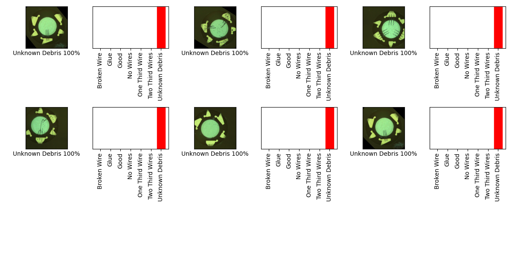

## 06_03_3:13:48PM 

## Stats 
```
Total Tests: 203
correct predictions: 87
incorrect predictions: 116
Percentage correct: 42.86%
=======================
Most missed predictions
Broken Wire:  29
Good:  1
No Wires:  26
One Third Wire:  3
Two Third Wires:  28
Unknown Debris:  29
``` 
### Model Summary 
```Model: "sequential"
_________________________________________________________________
Layer (type)                 Output Shape              Param #   
=================================================================
keras_layer (KerasLayer)     (None, 1024)              1529968   
_________________________________________________________________
dropout (Dropout)            (None, 1024)              0         
_________________________________________________________________
dense (Dense)                (None, 7)                 7175      
=================================================================
Total params: 1,537,143
Trainable params: 1,525,031
Non-trainable params: 12,112
_________________________________________________________________
``` 
### Confusion Matrix 
 
### Random Samples 
 
