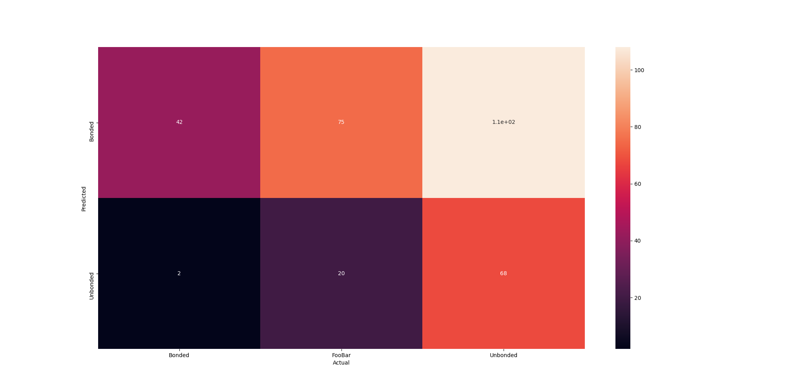

## 06_25_03:19:26PM 

## Stats 
```
Total Tests: 315
correct predictions: 110
incorrect predictions: 205
Percentage correct: 34.92%
=======================
Most missed predictions
Bonded:  2
Unbonded:  108
FooBar:  95
``` 
### Model Summary 
```Model: "sequential_4"
_________________________________________________________________
Layer (type)                 Output Shape              Param #   
=================================================================
sequential_1 (Sequential)    (None, 1280)              410208    
_________________________________________________________________
sequential_3 (Sequential)    (None, 3)                 128400    
=================================================================
Total params: 538,608
Trainable params: 524,528
Non-trainable params: 14,080
_________________________________________________________________
``` 
### Confusion Matrix 
 
### Random Samples 
 
