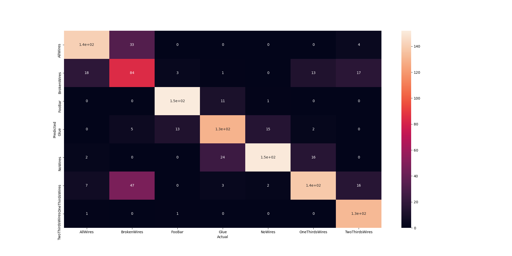
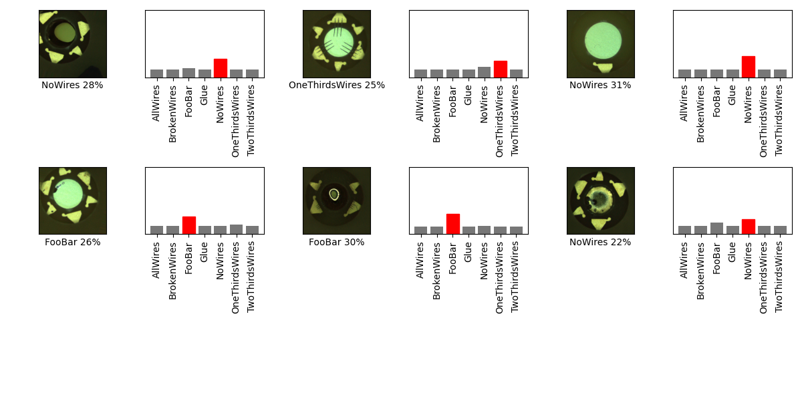

## 07_01_0346PM 
Teachable machine, 50 epochs, batch size 16, input shape 224x224

## Stats 
```
Total Tests: 1183
correct predictions: 928
incorrect predictions: 255
Percentage correct: 78.44%
=======================
Most missed predictions
AllWires:  28
BrokenWires:  85
FooBar:  17
Glue:  39
NoWires:  18
OneThirdsWires:  31
TwoThirdsWires:  37
``` 
### Confusion Matrix 
 
### Random Samples 
 
### Model Summary 
```Model: "sequential_6"
_________________________________________________________________
Layer (type)                 Output Shape              Param #   
=================================================================
sequential_3 (Sequential)    (None, 1280)              410208    
_________________________________________________________________
sequential_5 (Sequential)    (None, 7)                 128800    
=================================================================
Total params: 539,008
Trainable params: 524,928
Non-trainable params: 14,080
_________________________________________________________________
``` 
