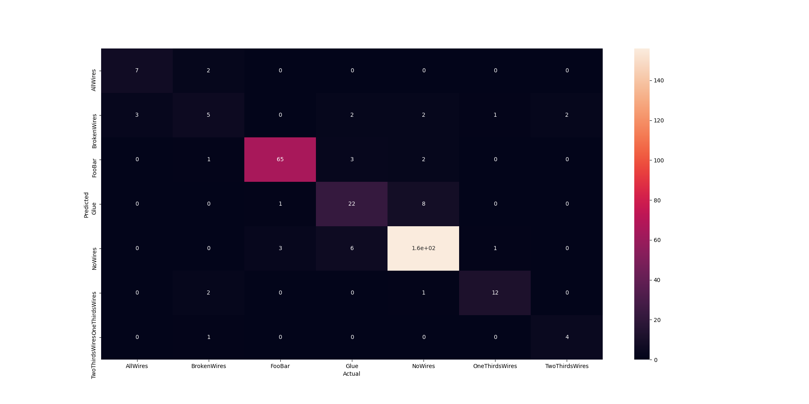
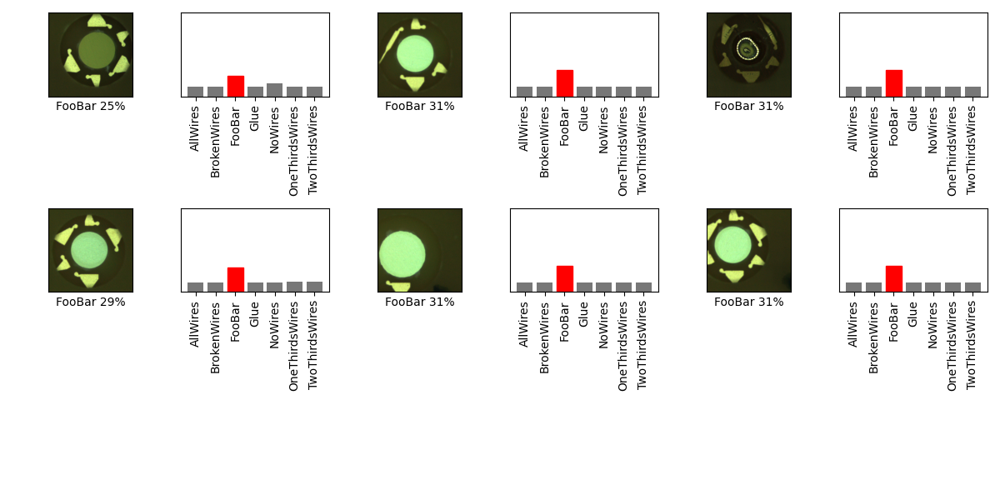

## 07_01_8:31:00PM 
teachable machine

## Stats 
```
Total Tests: 312
correct predictions: 271
incorrect predictions: 41
Percentage correct: 86.86%
Most missed predictions
AllWires:  3
BrokenWires:  6
FooBar:  4
Glue:  11
NoWires:  13
OneThirdsWires:  2
TwoThirdsWires:  2
``` 
### Model Summary 
```Model: "sequential_4"
_________________________________________________________________
Layer (type)                 Output Shape              Param #   
=================================================================
sequential_1 (Sequential)    (None, 1280)              410208    
_________________________________________________________________
sequential_3 (Sequential)    (None, 7)                 128800    
=================================================================
Total params: 539,008
Trainable params: 524,928
Non-trainable params: 14,080
_________________________________________________________________
``` 
### Confusion Matrix 
 
### Random Samples 
 
