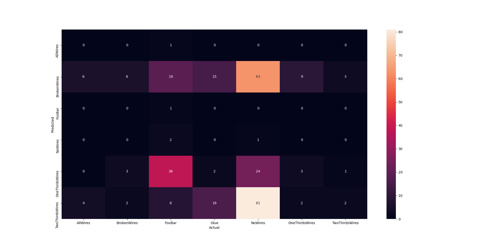

## 07_01_9:38:38PM 

## Stats 
```
Total Tests: 312
correct predictions: 13
incorrect predictions: 299
Percentage correct: 4.17%
Most missed predictions
AllWires:  10
BrokenWires:  5
FooBar:  68
Glue:  33
NoWires:  168
OneThirdsWires:  11
TwoThirdsWires:  4
``` 
### Model Summary 
```Model: "sequential"
_________________________________________________________________
Layer (type)                 Output Shape              Param #   
=================================================================
keras_layer (KerasLayer)     (None, 1001)              23853833  
_________________________________________________________________
dropout (Dropout)            (None, 1001)              0         
_________________________________________________________________
dense (Dense)                (None, 7)                 7014      
=================================================================
Total params: 23,860,847
Trainable params: 23,826,415
Non-trainable params: 34,432
_________________________________________________________________
``` 
### Confusion Matrix 
 
### Random Samples 
 
