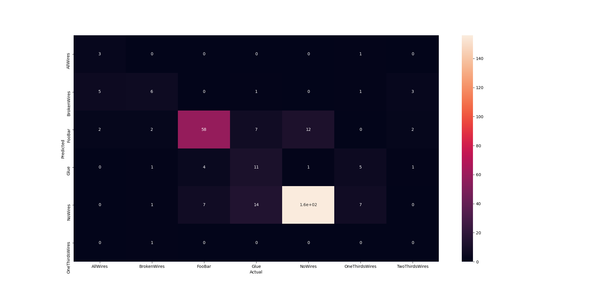
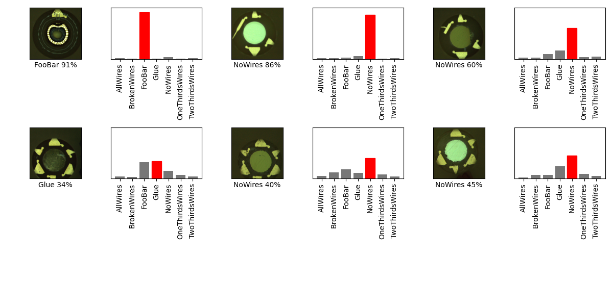

## 07_01_9:51:02PM 

## Stats 
```
Total Tests: 312
correct predictions: 234
incorrect predictions: 78
Percentage correct: 75.0%
Most missed predictions
AllWires:  7
BrokenWires:  5
FooBar:  11
Glue:  22
NoWires:  13
OneThirdsWires:  14
TwoThirdsWires:  6
``` 
### Model Summary 
```Model: "sequential"
_________________________________________________________________
Layer (type)                 Output Shape              Param #   
=================================================================
keras_layer (KerasLayer)     (None, 1024)              1529968   
_________________________________________________________________
dropout (Dropout)            (None, 1024)              0         
_________________________________________________________________
dense (Dense)                (None, 7)                 7175      
=================================================================
Total params: 1,537,143
Trainable params: 1,525,031
Non-trainable params: 12,112
_________________________________________________________________
``` 
### Confusion Matrix 
 
### Random Samples 
 
