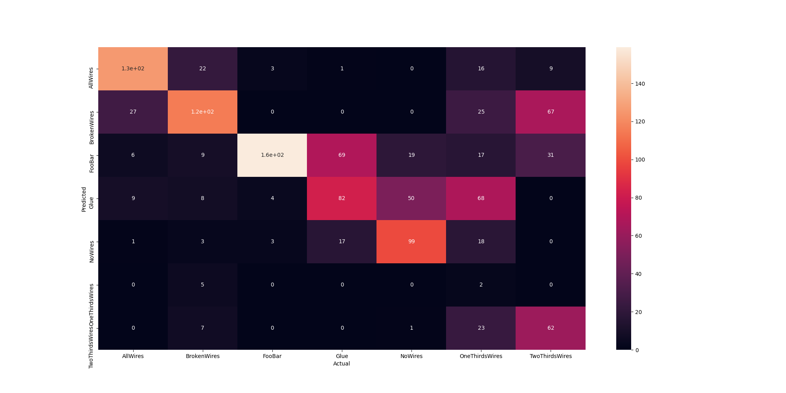
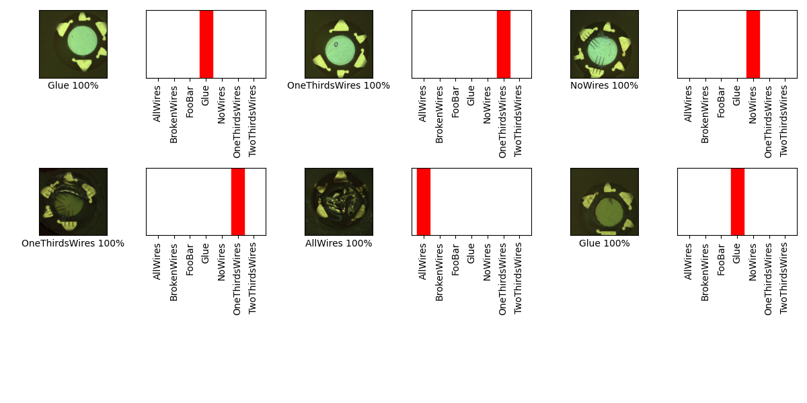

## 07_02_1:42:02PM 
## Stats 
```
Total Tests: 1183
correct predictions: 645
incorrect predictions: 538
Percentage correct: 54.52%
=======================
Most missed predictions
AllWires:  43
BrokenWires:  54
FooBar:  10
Glue:  87
NoWires:  70
OneThirdsWires:  167
TwoThirdsWires:  107
```
### Confusion Matrix 
 
### Random Samples 
 
### Model Summary 
```Model: "sequential"
_________________________________________________________________
Layer (type)                 Output Shape              Param #   
=================================================================
keras_layer (KerasLayer)     (None, 1024)              1529968   
_________________________________________________________________
dropout (Dropout)            (None, 1024)              0         
_________________________________________________________________
dense (Dense)                (None, 7)                 7175      
=================================================================
Total params: 1,537,143
Trainable params: 1,525,031
Non-trainable params: 12,112
_________________________________________________________________
```
