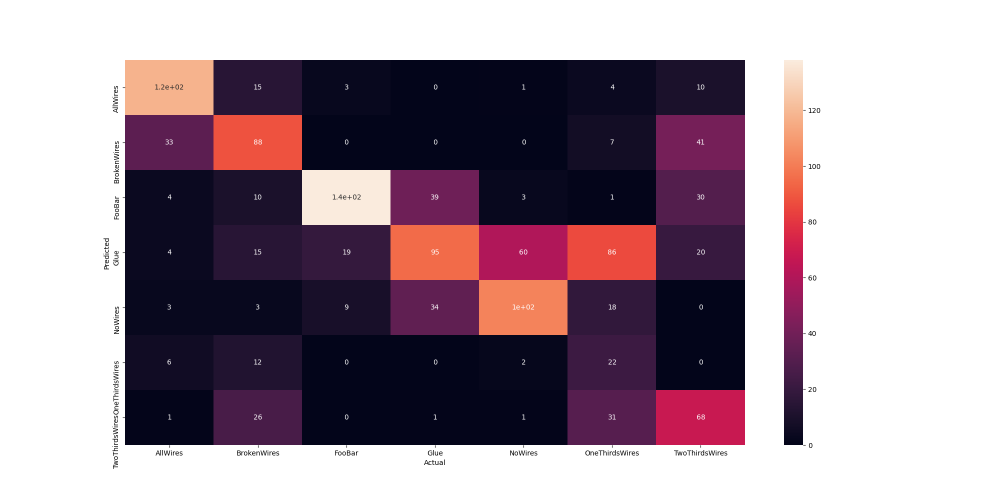
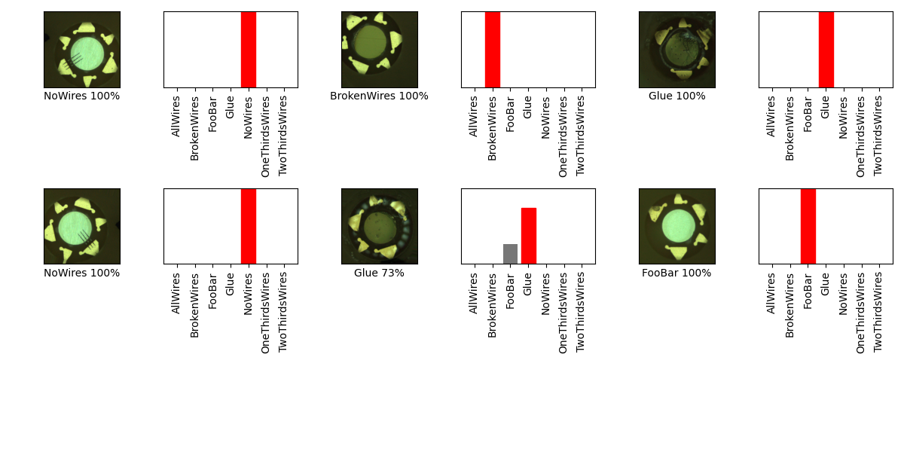

## 07_02_2:17:27PM 
mobilenet_v3_small_100_224, 10 epochs, batch size 128, 

##

## Stats 
```
Total Tests: 1183
correct predictions: 631
incorrect predictions: 552
Percentage correct: 53.34%
=======================
Most missed predictions
AllWires:  51
BrokenWires:  81
FooBar:  31
Glue:  74
NoWires:  67
OneThirdsWires:  147
TwoThirdsWires:  101
``` 
### Confusion Matrix 
 
### Random Samples 
 
### Model Summary 
```Model: "sequential"
_________________________________________________________________
Layer (type)                 Output Shape              Param #   
=================================================================
keras_layer (KerasLayer)     (None, 1024)              1529968   
_________________________________________________________________
dropout (Dropout)            (None, 1024)              0         
_________________________________________________________________
dense (Dense)                (None, 7)                 7175      
=================================================================
Total params: 1,537,143
Trainable params: 1,525,031
Non-trainable params: 12,112
_________________________________________________________________
``` 
