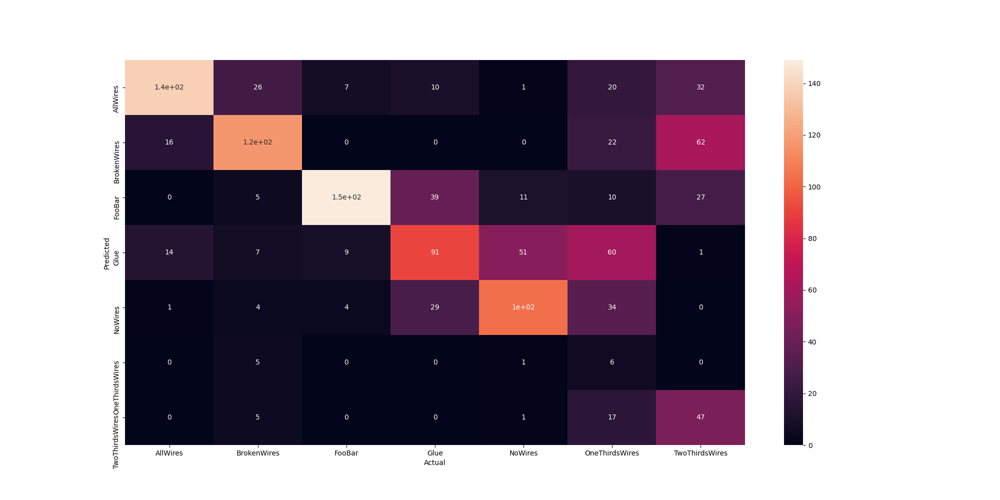
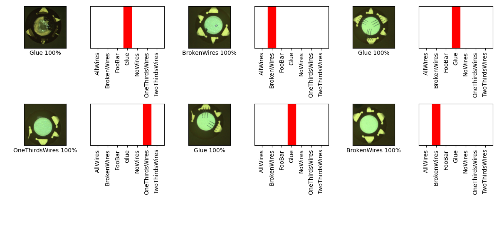

## 07_02_2:56:28PM 

## Stats 
```
Total Tests: 1183
correct predictions: 652
incorrect predictions: 531
Percentage correct: 55.11%
=======================
Most missed predictions
AllWires:  31
BrokenWires:  52
FooBar:  20
Glue:  78
NoWires:  65
OneThirdsWires:  163
TwoThirdsWires:  122
``` 
### Confusion Matrix 
 
### Random Samples 
 
### Model Summary 
```Model: "sequential"
_________________________________________________________________
Layer (type)                 Output Shape              Param #   
=================================================================
keras_layer (KerasLayer)     (None, 1024)              1529968   
_________________________________________________________________
dropout (Dropout)            (None, 1024)              0         
_________________________________________________________________
dense (Dense)                (None, 7)                 7175      
=================================================================
Total params: 1,537,143
Trainable params: 1,525,031
Non-trainable params: 12,112
_________________________________________________________________
``` 
