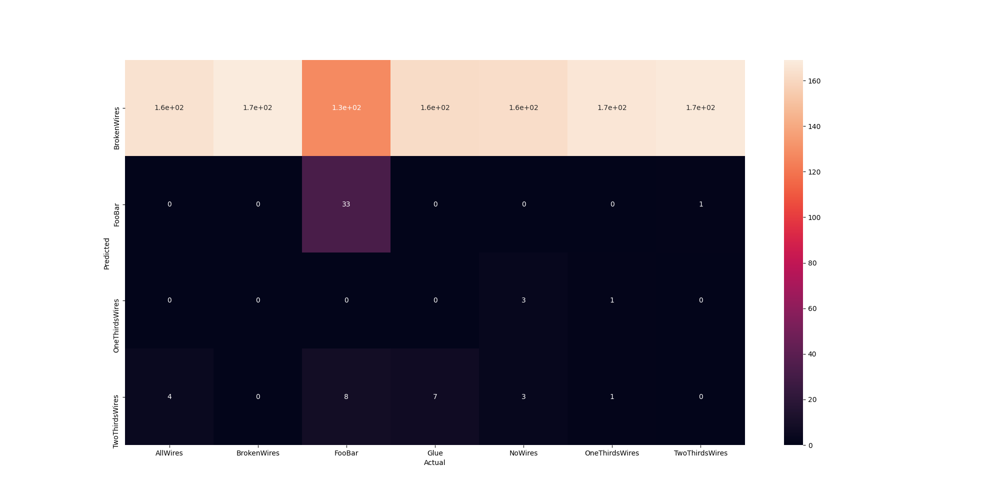
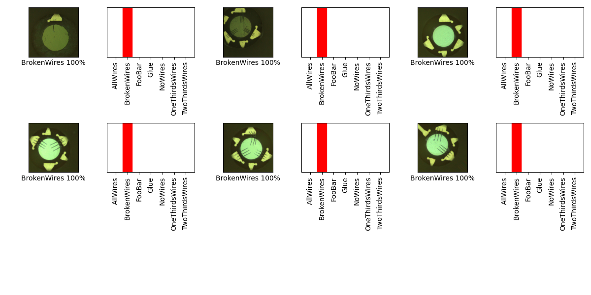

## 07_02_31513PM 

## Stats 
```
Total Tests: 1183
correct predictions: 203
incorrect predictions: 980
Percentage correct: 17.16%
=======================
Most missed predictions
AllWires:  169
FooBar:  136
Glue:  169
NoWires:  169
OneThirdsWires:  168
TwoThirdsWires:  169
```
### Confusion Matrix 
 
### Random Samples 
 
### Model Summary 
```Model: "sequential"
_________________________________________________________________
Layer (type)                 Output Shape              Param #   
=================================================================
keras_layer (KerasLayer)     (None, 1001)              23853833  
_________________________________________________________________
dropout (Dropout)            (None, 1001)              0         
_________________________________________________________________
dense (Dense)                (None, 7)                 7014      
=================================================================
Total params: 23,860,847
Trainable params: 23,826,415
Non-trainable params: 34,432
_________________________________________________________________
```
