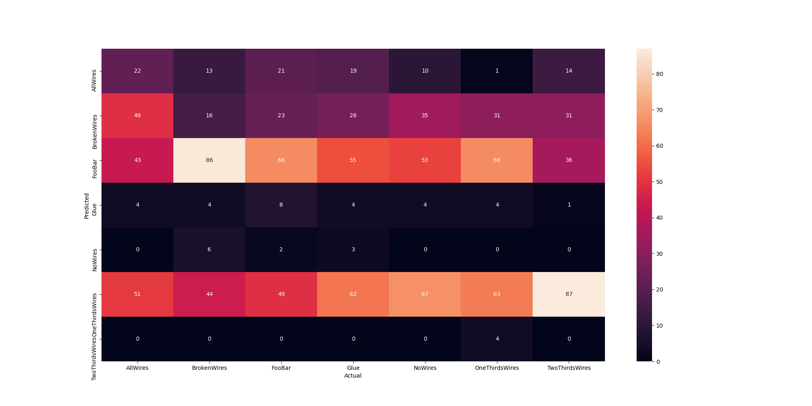

## 07_04_32712PM 

## Stats 
```
Total Tests: 1183
correct predictions: 171
incorrect predictions: 1012
Percentage correct: 14.45%
=======================
Most missed predictions
AllWires:  147
BrokenWires:  153
FooBar:  103
Glue:  165
NoWires:  169
OneThirdsWires:  106
TwoThirdsWires:  169
``` 
### Confusion Matrix 
 
### Random Samples 
 
### Model Summary 
```Model: "sequential"
_________________________________________________________________
Layer (type)                 Output Shape              Param #   
=================================================================
keras_layer (KerasLayer)     (None, 2048)              28513520  
_________________________________________________________________
dropout (Dropout)            (None, 2048)              0         
_________________________________________________________________
dense (Dense)                (None, 7)                 14343     
=================================================================
Total params: 28,527,863
Trainable params: 28,355,127
Non-trainable params: 172,736
_________________________________________________________________
``` 
