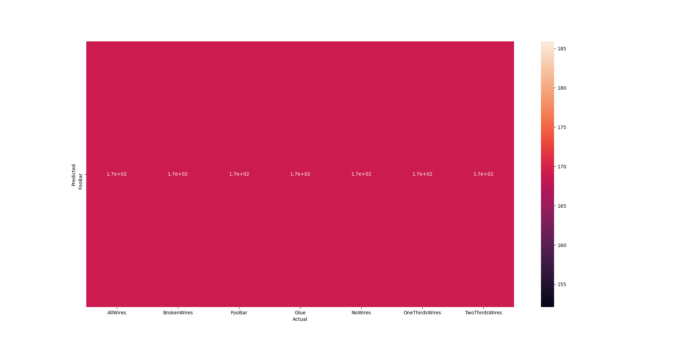
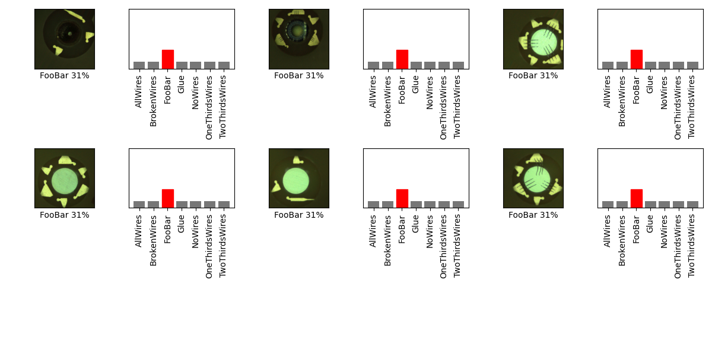

## 07_04_5:15:00PM 

## Stats 
```
Total Tests: 1183
correct predictions: 169
incorrect predictions: 1014
Percentage correct: 14.29%
=======================
Most missed predictions
AllWires:  169
BrokenWires:  169
Glue:  169
NoWires:  169
OneThirdsWires:  169
TwoThirdsWires:  169
``` 
### Confusion Matrix 
 
### Random Samples 
 
### Model Summary 
```Model: "sequential"
_________________________________________________________________
Layer (type)                 Output Shape              Param #   
=================================================================
rescaling (Rescaling)        (None, 480, 480, 3)       0         
_________________________________________________________________
conv2d (Conv2D)              (None, 480, 480, 16)      448       
_________________________________________________________________
conv2d_1 (Conv2D)            (None, 480, 480, 16)      2320      
_________________________________________________________________
max_pooling2d (MaxPooling2D) (None, 240, 240, 16)      0         
_________________________________________________________________
conv2d_2 (Conv2D)            (None, 240, 240, 32)      4640      
_________________________________________________________________
conv2d_3 (Conv2D)            (None, 240, 240, 32)      9248      
_________________________________________________________________
batch_normalization (BatchNo (None, 240, 240, 32)      128       
_________________________________________________________________
max_pooling2d_1 (MaxPooling2 (None, 120, 120, 32)      0         
_________________________________________________________________
conv2d_4 (Conv2D)            (None, 120, 120, 32)      9248      
_________________________________________________________________
conv2d_5 (Conv2D)            (None, 120, 120, 32)      9248      
_________________________________________________________________
max_pooling2d_2 (MaxPooling2 (None, 60, 60, 32)        0         
_________________________________________________________________
conv2d_6 (Conv2D)            (None, 60, 60, 32)        9248      
_________________________________________________________________
conv2d_7 (Conv2D)            (None, 60, 60, 32)        9248      
_________________________________________________________________
max_pooling2d_3 (MaxPooling2 (None, 30, 30, 32)        0         
_________________________________________________________________
conv2d_8 (Conv2D)            (None, 30, 30, 32)        9248      
_________________________________________________________________
conv2d_9 (Conv2D)            (None, 30, 30, 32)        9248      
_________________________________________________________________
max_pooling2d_4 (MaxPooling2 (None, 15, 15, 32)        0         
_________________________________________________________________
conv2d_10 (Conv2D)           (None, 15, 15, 32)        9248      
_________________________________________________________________
conv2d_11 (Conv2D)           (None, 15, 15, 32)        9248      
_________________________________________________________________
max_pooling2d_5 (MaxPooling2 (None, 7, 7, 32)          0         
_________________________________________________________________
conv2d_12 (Conv2D)           (None, 7, 7, 64)          18496     
_________________________________________________________________
max_pooling2d_6 (MaxPooling2 (None, 2, 2, 64)          0         
_________________________________________________________________
flatten (Flatten)            (None, 256)               0         
_________________________________________________________________
dense (Dense)                (None, 128)               32896     
_________________________________________________________________
dropout (Dropout)            (None, 128)               0         
_________________________________________________________________
dense_1 (Dense)              (None, 32)                4128      
_________________________________________________________________
dense_2 (Dense)              (None, 32)                1056      
_________________________________________________________________
dense_3 (Dense)              (None, 7)                 231       
=================================================================
Total params: 147,575
Trainable params: 147,511
Non-trainable params: 64
_________________________________________________________________
``` 
