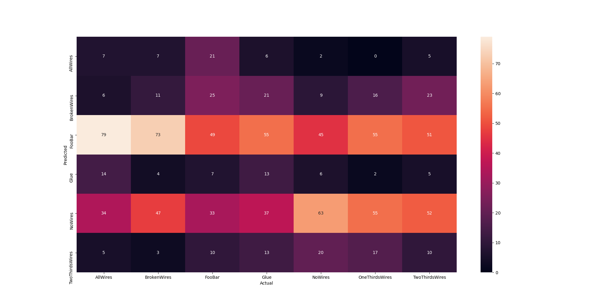

## 07_12_31926PM_save_model 

## Stats 
```
Total Tests: 1016
correct predictions: 153
incorrect predictions: 863
Percentage correct: 15.06%
=======================
Most missed predictions
AllWires:  138
BrokenWires:  134
FooBar:  96
Glue:  132
NoWires:  82
OneThirdsWires:  145
TwoThirdsWires:  136
``` 
### Confusion Matrix 
 
### Random Samples 
 
### Model Summary 
```Model: "sequential"
_________________________________________________________________
Layer (type)                 Output Shape              Param #   
=================================================================
keras_layer (KerasLayer)     (None, 1024)              1529968   
_________________________________________________________________
dropout (Dropout)            (None, 1024)              0         
_________________________________________________________________
dense (Dense)                (None, 7)                 7175      
=================================================================
Total params: 1,537,143
Trainable params: 1,525,031
Non-trainable params: 12,112
_________________________________________________________________
``` 
