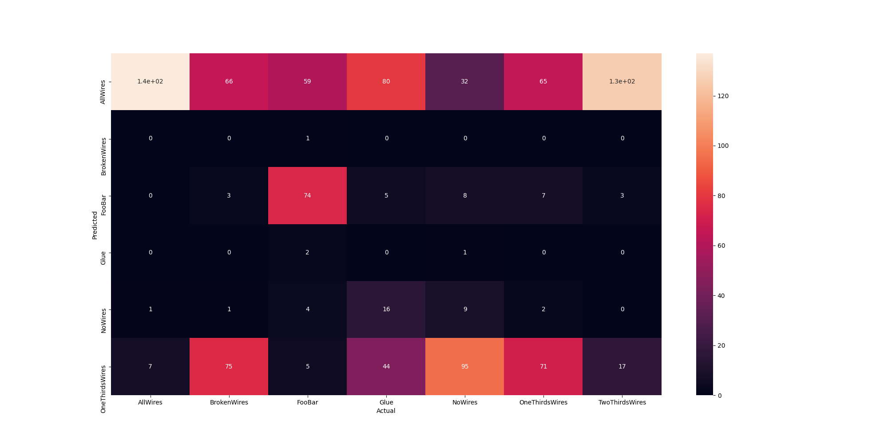
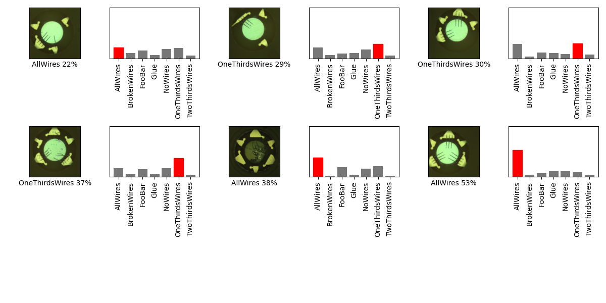

## 07_12_33719PM 

## Stats 
```
Total Tests: 1016
correct predictions: 291
incorrect predictions: 725
Percentage correct: 28.64%
=======================
Most missed predictions
AllWires:  8
BrokenWires:  145
FooBar:  71
Glue:  145
NoWires:  136
OneThirdsWires:  74
TwoThirdsWires:  146
``` 
### Confusion Matrix 
 
### Random Samples 
 
### Model Summary 
```Model: "sequential"
_________________________________________________________________
Layer (type)                 Output Shape              Param #   
=================================================================
keras_layer (KerasLayer)     (None, 1024)              1529968   
_________________________________________________________________
dropout (Dropout)            (None, 1024)              0         
_________________________________________________________________
dense (Dense)                (None, 7)                 7175      
=================================================================
Total params: 1,537,143
Trainable params: 1,525,031
Non-trainable params: 12,112
_________________________________________________________________
``` 
