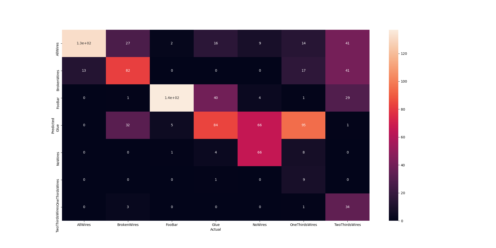
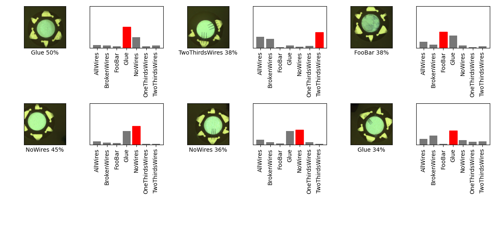

## 07_12_34854PM_saved_model 

## Stats 
```
Total Tests: 1016
correct predictions: 544
incorrect predictions: 472
Percentage correct: 53.54%
=======================
Most missed predictions
AllWires:  13
BrokenWires:  63
FooBar:  8
Glue:  61
NoWires:  79
OneThirdsWires:  136
TwoThirdsWires:  112
``` 
### Confusion Matrix 
 
### Random Samples 
 
### Model Summary 
```Model: "sequential"
_________________________________________________________________
Layer (type)                 Output Shape              Param #   
=================================================================
keras_layer (KerasLayer)     (None, 1024)              1529968   
_________________________________________________________________
dropout (Dropout)            (None, 1024)              0         
_________________________________________________________________
dense (Dense)                (None, 7)                 7175      
=================================================================
Total params: 1,537,143
Trainable params: 1,525,031
Non-trainable params: 12,112
_________________________________________________________________
``` 
