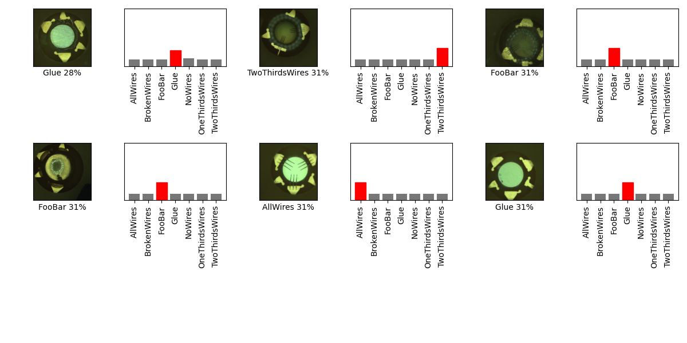

## 07_12_edge-all-TM 

## Stats 
```
Total Tests: 1016
correct predictions: 864
incorrect predictions: 152
Percentage correct: 85.04%
=======================
Most missed predictions
BrokenWires:  50
FooBar:  16
Glue:  31
NoWires:  16
OneThirdsWires:  37
TwoThirdsWires:  2
``` 
### Confusion Matrix 
 
### Random Samples 
 
### Model Summary 
```Model: "sequential_4"
_________________________________________________________________
Layer (type)                 Output Shape              Param #   
=================================================================
sequential_1 (Sequential)    (None, 1280)              410208    
_________________________________________________________________
sequential_3 (Sequential)    (None, 7)                 128800    
=================================================================
Total params: 539,008
Trainable params: 524,928
Non-trainable params: 14,080
_________________________________________________________________
``` 
