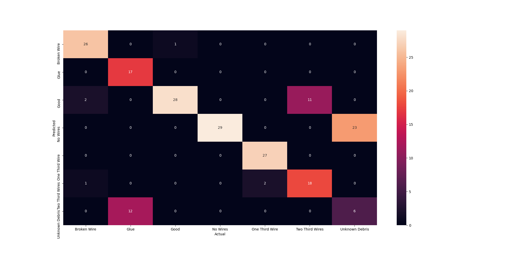
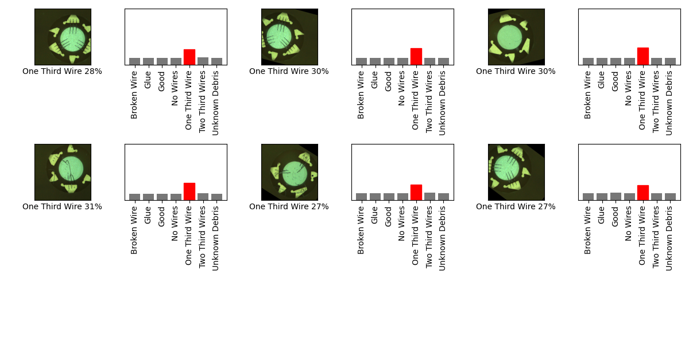

## model.savedmodel 

## Stats 
```
Total Tests: 203
correct predictions: 151
incorrect predictions: 52
Percentage correct: 74.38%
=======================
Most missed predictions
Broken Wire:  3
Glue:  12
Good:  1
One Third Wire:  2
Two Third Wires:  11
Unknown Debris:  23
``` 
### Model Summary 
```Model: "sequential_4"
_________________________________________________________________
Layer (type)                 Output Shape              Param #   
=================================================================
sequential_1 (Sequential)    (None, 1280)              410208    
_________________________________________________________________
sequential_3 (Sequential)    (None, 7)                 128800    
=================================================================
Total params: 539,008
Trainable params: 524,928
Non-trainable params: 14,080
_________________________________________________________________
``` 
### Confusion Matrix 
 
### Random Samples 
 
